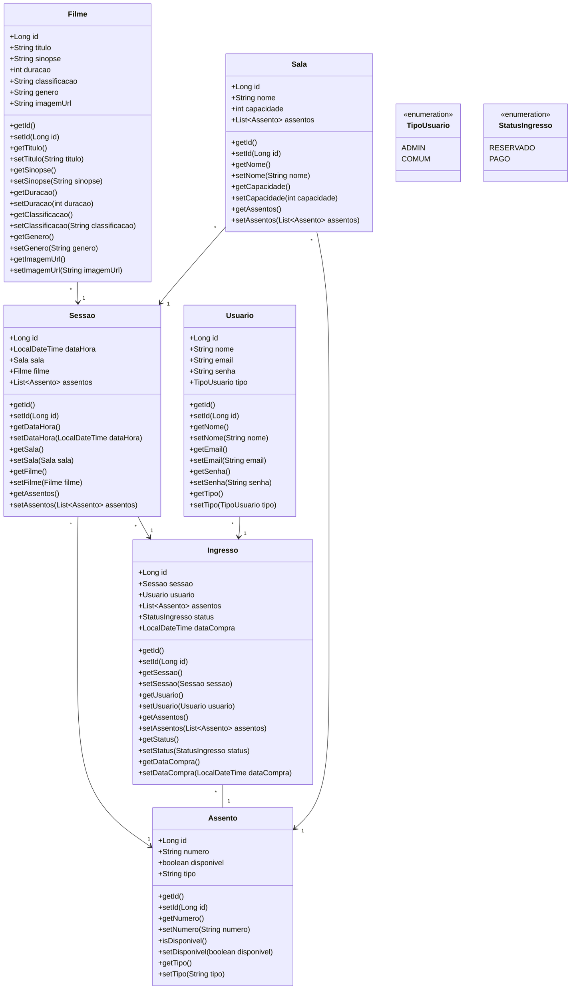

# Fábrica de Software 2025/1
Alunos: Fellipe N. Prim e Lucas Felipe

## Proposta

Este projeto tem como objetivo o desenvolvimento de um sistema semelhante ao **GNC Cinemas**, uma plataforma para venda e reserva de ingressos de cinema, utilizando as tecnologias **Java** (Spring Boot) para o backend e **Angular** para o frontend.

### Funcionalidades

#### Usuários comuns
- Visualizar filmes em cartaz
- Escolher sessões e horários disponíveis
- Selecionar assentos disponíveis para uma sessão
- Realizar reserva e compra de ingressos
- Consultar histórico de ingressos adquiridos

#### Administradores
- Realizar CRUD completo (Create, Read, Update, Delete) de sessões de cinema, incluindo:
  - Cadastro de novas sessões vinculadas a filmes e salas
  - Atualização de informações das sessões (data, horário, sala)
  - Remoção de sessões canceladas ou expiradas
  - Consulta detalhada das sessões disponíveis

O desenvolvimento seguirá os princípios da **Clean Architecture**, garantindo uma separação clara entre as camadas de domínio, aplicação, interface e infraestrutura, facilitando a manutenção e escalabilidade do sistema.

### Tecnologias principais
- Backend: Java, Spring Boot
- Frontend: Angular
- Banco de dados: MySQL/PostgreSQL (a definir)
- Controle de versionamento: Git

### Histórias de usuários
#### Usuários comuns
- Visualizar filmes em cartaz  
  *Como usuário comum, quero visualizar a lista de filmes atualmente em cartaz para escolher qual filme quero assistir.*
- Escolher sessões e horários disponíveis  
  *Como usuário comum, quero ver as sessões e horários disponíveis para o filme escolhido para selecionar o momento que melhor me convém.*
- Selecionar assentos disponíveis para uma sessão  
  *Como usuário comum, quero escolher os assentos disponíveis para a sessão selecionada para garantir meus lugares preferidos na sala.*
- Realizar reserva e compra de ingressos  
  *Como usuário comum, quero reservar e efetuar a compra dos ingressos para garantir minha presença na sessão desejada.*
- Consultar histórico de ingressos adquiridos  
  *Como usuário comum, quero acessar o histórico das minhas compras de ingressos para consultar minhas sessões assistidas ou planejar futuras idas ao cinema.*

#### Administradores
- Realizar CRUD completo (Create, Read, Update, Delete) de sessões de cinema, incluindo:
  - Cadastro de novas sessões vinculadas a filmes e salas  
    *Como administrador, quero cadastrar novas sessões com data, horário, filme e sala para disponibilizá-las para venda aos usuários.*
  - Atualização de informações das sessões (data, horário, sala)  
    *Como administrador, quero alterar informações das sessões para corrigir ou ajustar os detalhes conforme necessidade.*
  - Remoção de sessões canceladas ou expiradas  
    *Como administrador, quero remover sessões que foram canceladas ou já expiraram para manter o sistema atualizado e evitar confusões para os usuários.*
  - Consulta detalhada das sessões disponíveis

  ## Aula 19/08
## Diagrama de entidades

- [Extensão Mermaid](https://marketplace.visualstudio.com/items?itemName=vstirbu.vscode-mermaid-preview)
- [Mermaid ClassDiagram](https://github.com/mermaid-js/mermaid/blob/develop/packages/mermaid/src/docs/syntax/classDiagram.md)

| Type    | Description   |
| ------- | ------------- |
| `<\|--` | Inheritance   |
| `*--`   | Composition   |
| `o--`   | Aggregation   |
| `-->`   | Association   |
| `--`    | Link (Solid)  |
| `..>`   | Dependency    |
| `..\|>` | Realization   |
| `..`    | Link (Dashed) |


## Aula 19/08
## Diagrama de entidades

- [Extensão Mermaid](https://marketplace.visualstudio.com/items?itemName=vstirbu.vscode-mermaid-preview)
- [Mermaid ClassDiagram](https://github.com/mermaid-js/mermaid/blob/develop/packages/mermaid/src/docs/syntax/classDiagram.md)

| Type    | Description   |
| ------- | ------------- |
| `<\|--` | Inheritance   |
| `*--`   | Composition   |
| `o--`   | Aggregation   |
| `-->`   | Association   |
| `--`    | Link (Solid)  |
| `..>`   | Dependency    |
| `..\|>` | Realization   |
| `..`    | Link (Dashed) |



```


---

Este repositório será utilizado para organizar todo o código-fonte, documentação e demais artefatos relacionados ao projeto ao longo do semestre.

---

